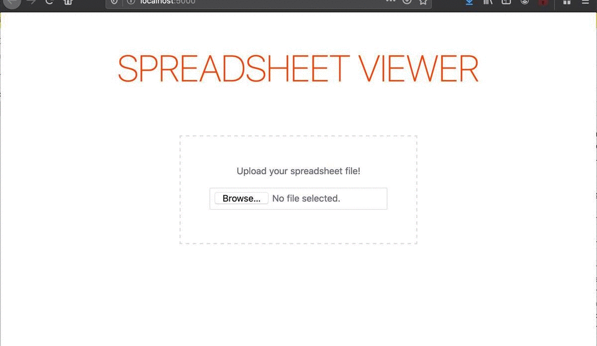

# Spreadsheet Viewer

This is a hobby project to view and edit basic xlsx/xls spreadsheet files with some simple functions.



## Motivation

- To take a sneak peek the [Svelte](https://svelte.dev) framework.
- To reduce the work of my friend who opens hundreds of tabs in browser to select products from Excel photos :)

## To Do

- Grid view as an alternative to the table view.
- Toggle button to hide/show column settings.
- Input for update items per page.


---


# Usage

spreadsheet-viewer.blablabla.com -

or your local

*Note that you will need to have [Node.js](https://nodejs.org) installed.*

## Get started

Install the dependencies...

```bash
git clone https://github.com/irfansimsar/svelte-spreadsheet-viewer.git
cd svelte-spreadsheet-viewer
npm install
```

...then start [Rollup](https://rollupjs.org):

```bash
npm run dev
```

Navigate to [localhost:5000](http://localhost:5000). You should see your app running. Edit a component file in `src`, save it, and reload the page to see your changes.

By default, the server will only respond to requests from localhost. To allow connections from other computers, edit the `sirv` commands in package.json to include the option `--host 0.0.0.0`.
